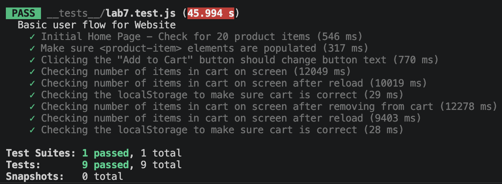

# Lab 7 - Browser Testing with Puppeteer

## 1. Where would you fit your automated tests in your Recipe project development pipeline?

**Answer: Within a GitHub Action that runs whenever code is pushed.**

Automating tests through a GitHub Action is the most reliable approach because it removes the risk of human error. Developers can forget to run tests manually, skip them when rushing, or assume small changes don't need testing, whereas an automated workflow runs on every push without exception. It also catches bugs immediately by flagging failing commits before they affect teammates, unlike waiting until the end of development, where early bugs would compound and become much harder to track down. This practice is known as Continuous Integration (CI) and is an industry standard because automation enforces consistency in a way that human discipline cannot.

## 2. Would you use an end-to-end test to check if a function is returning the correct output?

**Answer: No.**

End-to-end tests are designed to simulate a real user interacting with the full application in a browser such as clicking buttons, filling forms, and navigating pages which makes them slow because they require spinning up an actual browser and loading the whole app. Checking whether a function returns the correct output for a given input is what unit tests are designed for as they run a function in isolation with no browser or DOM involved, making them much faster and more focused. Using E2E tests for simple function-output verification would be massive overkill and would significantly slow down the test suite.

## 3. What is the difference between navigation and snapshot mode?

**Answer:** Navigation mode and Snapshot mode differ in what they audit and when. Navigation mode analyzes a page right after it loads, measuring the entire loading process and producing an overall performance score. It is also the standard mode for evaluating how a page performs from a user's first visit. On the other hand, Snapshot mode analyzes a page in its current state without reloading it, which makes it best suited for finding accessibility issues in dynamic content but unable to measure JavaScript performance or any changes made to the DOM over time. In short, Navigation mode evaluates the full page-load experience, while Snapshot mode essentially takes a screenshot and checks whatever the page currently looks like.

## 4. Name three things we could do to improve the CSE 110 shop site based on the Lighthouse results.

**Answer:**

1. **Add a `lang` attribute to the `<html>` element.** Lighthouse flagged that the `<html>` tag is missing this attribute, which lowered the Accessibility score to 90. Adding something like `<html lang="en">` helps screen readers pronounce the page content correctly and signals the page's language to browsers and translation tools.

2. **Reduce unused JavaScript.** The Diagnostics section reported an estimated savings of 1,321 KiB by removing unused JavaScript that never runs. Cutting this would speed up page loads significantly, especially on slower connections, by sending users only the code they actually need.

3. **Add a meta description to the document.** Lighthouse flagged that the page has no meta description, which lowered the SEO score to 91. Adding a `<meta name="description" content="...">` tag in the HTML head improves how the site appears in search engine results and helps search crawlers understand what the page is about.

## Test Result

